# Serverless Employee Face Recognition & Attendance Management System

## Project Overview

This project demonstrates a serverless employee attendance management system developed collaboratively as part of an AWS Cloud Internship at F13 Technologies. It uses facial recognition to help identify registered employees and record attendance.

This repository contains the project architecture, AWS implementation screenshots, and project documentation. A live public demo is not currently available.

## Objectives

- Automate employee attendance using facial recognition.
- Provide an administrator interface for employee registration and attendance tracking.
- Store employee details and attendance records using AWS services.
- Use serverless components to reduce infrastructure management.

## AWS Services Used

- **Amazon Rekognition:** Face comparison for employee identification.
- **AWS Lambda:** Backend processing and automation.
- **Amazon API Gateway:** API endpoints for application requests.
- **Amazon DynamoDB:** Employee details and attendance records.
- **Amazon S3:** Image storage and related assets.
- **Amazon Cognito:** Administrator authentication.
- **Amazon EventBridge:** Scheduled tasks.
- **Amazon CloudWatch:** Logs and monitoring.
- **AWS IAM:** Access permissions and security.

## System Workflow

1. The administrator signs in and registers an employee.
2. Employee information and reference images are stored using AWS services.
3. The employee's face is captured for verification.
4. AWS Lambda processes the request and uses Amazon Rekognition to compare the face with the registered reference.
5. When a match is successful, attendance information is recorded in DynamoDB.
6. The administrator can view employee and attendance information through the dashboard.
7. Scheduled tasks support configured archival or cleanup activities.

## Architecture

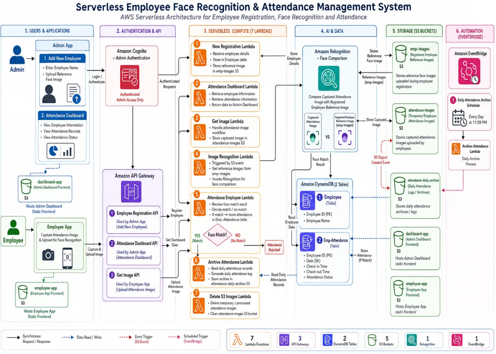

## Implementation Screenshots

### 1. Administrator Dashboard
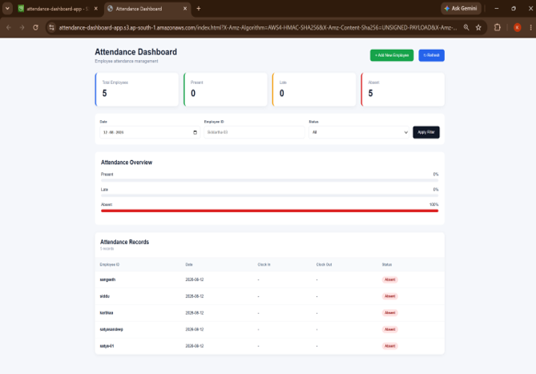

### 2. Add Employee
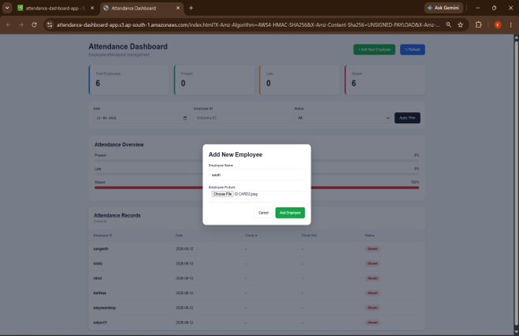

### 3. Attendance Result
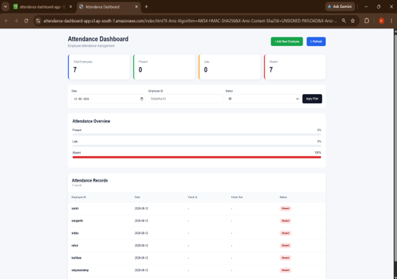

### 4. Administrator Login
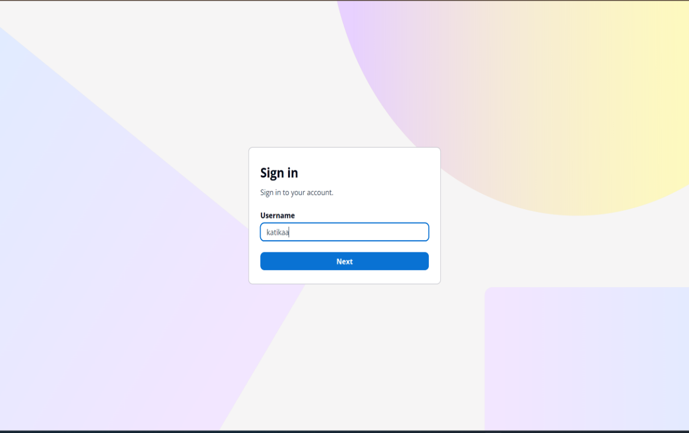

### 5. API Gateway

### 6. CloudWatch Logs
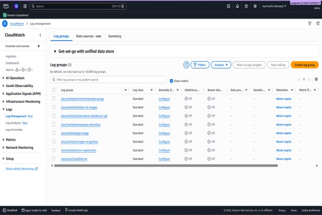

### 7. DynamoDB Tables
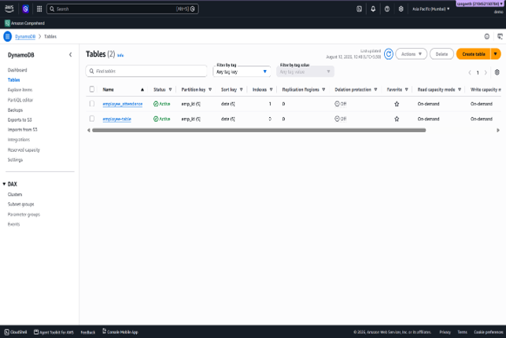

### 8. EventBridge Schedules
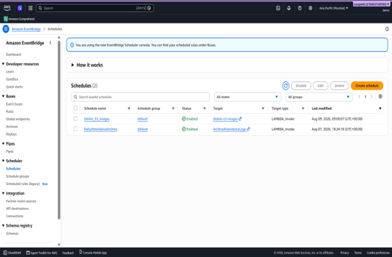

### 9. Lambda Functions
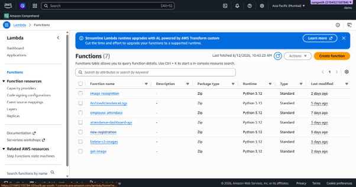

### 10. S3 Storage
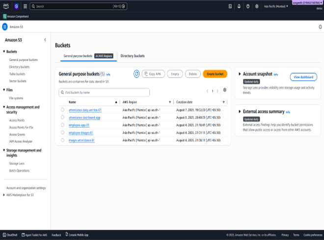

### 11. Employee Face Capture
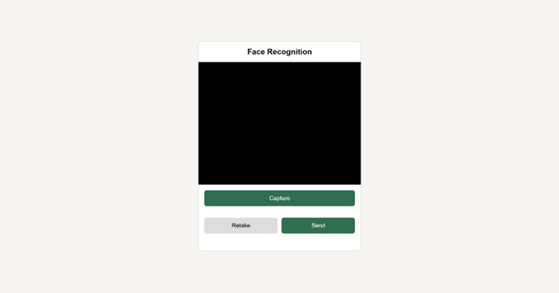

### 12. Employee Face Captured Screen
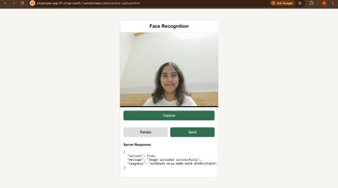

## Repository Structure

- `architecture/` — AWS architecture diagram.
- `screenshots/` — Application interface and AWS configuration screenshots.
- `docs/` — Project report and supporting documentation.

## Project Status

This repository is a documentation and implementation showcase. It does not currently provide a working public demo.

## Acknowledgement

Developed collaboratively with team members as part of the AWS Cloud Internship at F13 Technologies.
